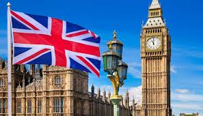

Title: UK Parliament Initiatives
Category: Agriculture
Tags: climate, solutions, government
Slug: government-initiatives
Authors: Climate Solutions
Cover: https://deytalytics.github.io/images/uk-parliament.jpg
Summary: Covers what the UK parliament & associated bodies have done and are doing to combat climate change

All of the major parties in the UK, have been supportive of measures to combat climate change.

Acts so far have included:-

* 2008 - UK Parliament agrees Climate Change Act, committing the UK to reduce CO2 emissions by 80% compared to 1990 levels. Additionally creates the Committee of Climate Change who are tasked with determining 5 year climate reduction budgets and holding the UK to account
* 2019 - UK becomes first country in the world to legally commit to net zero carbon by 2050
* 2019 - UK declares a climate emergency
* 2020 - UK convenes a Climate Assembly, with members picked at random from a population set determined on a spread of known political, racial, gender etc. demographics to be broadly representative of the UK population. It's report came out in September 2020 highlighting areas where climate solutions could be developed by 2050.

